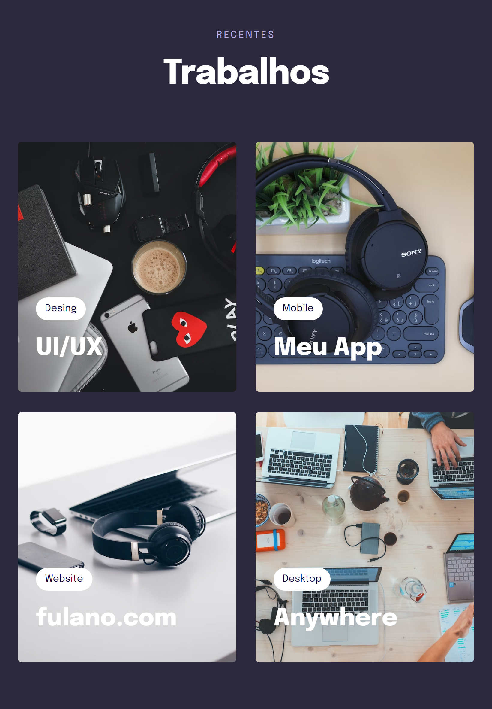
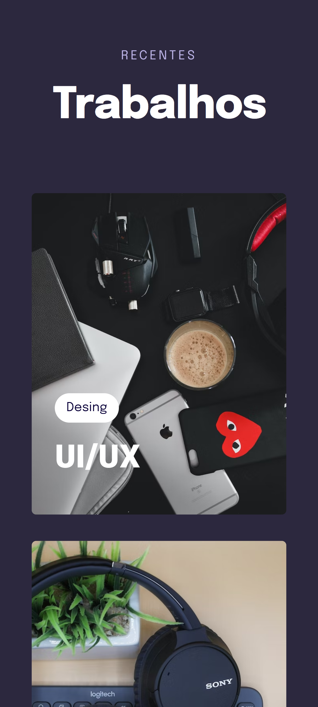

# Explorer Turma 6

> Projeto 05 criado no programa Explorer da RocketSeat

Nesse projeto aprendemos como criar variáveis, uma nova maneira de escolher cores(hsl), a tag transform para dar destaques a certos elementos na página, à criar animações e aplicar filtros com o css, aprofundamos o grid utilizando templates e também como usar a função clamp()

>Desktop

>Tablet/iPad

>Phones/Small devices

## Tecnologias
HTML
CSS

## Contato
daniel.aretakis@hotmail.com